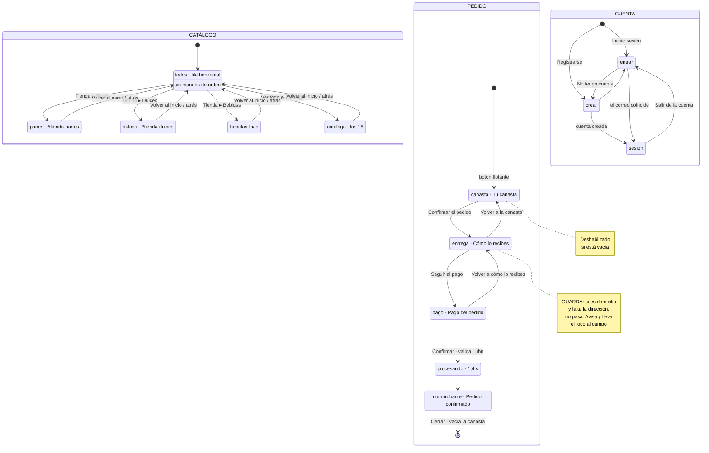

# Reto 4 · Entregable 3 — Diseño de interacción y modelo mental

5 de los 20 puntos. Criterio literal: *"Claridad del flujo de tareas, eficiencia en la navegación y coherencia funcional."* El enunciado pide tres cosas: **diagrama de estados**, **secuencia de tareas** y **respuesta del sistema**.

Materia prima, no texto para entregar. Los bloques `> ESCRIBE TÚ` son tuyos.

---

## 1. Lo que cambió: los clics están contados

En la guía te dije que faltaban dos cosas: dibujar el diagrama y contar los clics.

**Los clics están contados** — conduciendo la interfaz de verdad en Chrome, tres caminos completos hasta el comprobante (§3).

**El diagrama sigue siendo tuyo**, pero ya no partes de cero: en §2 tienes el código fuente en Mermaid, que se convierte en diagrama pegándolo en un renderizador. Tú decides si lo usas así o lo redibujas (§2.4).

---

## 2. El diagrama de estados

### 2.1 Las tres máquinas, verificadas sobre el código

No son un dibujo sobre el diseño: están implementadas. Comprobé cada transición leyendo el código el 2026-10-04.

**Máquina A — la vista del catálogo.** Variable `categoria`. Cada estado tiene URL propia y entrada en el historial (`history.pushState`), y el botón "atrás" del navegador funciona (`popstate`).

| Desde | A | Qué lo dispara | URL que queda |
|---|---|---|---|
| `todos` | `panes` | Tienda → "Panes", o botón "Ver todo" → no | `#tienda-panes` |
| `todos` | `dulces` | Tienda → "Dulces y pasteles" | `#tienda-dulces` |
| `todos` | `bebidas-frias` | Tienda → "Bebidas" | `#tienda-bebidas-frias` |
| `todos` | `catalogo` | Tienda → "Todo el catálogo", o el botón "Ver todo el catálogo" del mostrador | `#tienda-catalogo` |
| cualquiera | `todos` | Botón "Volver al inicio", o el botón atrás del navegador | `/` |
| cualquiera | cualquiera | Otra entrada de Tienda. **Cada categoría se entra limpia**: el orden y el filtro vuelven a su valor inicial | la de destino |

Diferencias de estado, no solo de contenido:

- En `todos`: cuadrícula en **fila horizontal**, con rótulo, botón de pausa y "Ver todo". Sin mandos de ordenar.
- En los otros cuatro: **cuadrícula normal**, con cabecera propia, "Volver al inicio", ordenar (4 opciones) y mostrar (2 opciones). El `<title>` del documento cambia.

**Máquina B — el pedido.** Variable `pasoActual`, cuatro pasos. El título del diálogo cambia con el paso, y por eso el `aria-labelledby` sigue nombrándolo bien.

| Desde | A | Qué lo dispara | Nombre del paso |
|---|---|---|---|
| — | `canasta` | Abrir el panel (botón flotante) | "Tu canasta" |
| `canasta` | `entrega` | "Confirmar el pedido" — **deshabilitado si la canasta está vacía** | "Cómo lo recibes" |
| `entrega` | `canasta` | "Volver a la canasta" | |
| `entrega` | `pago` | "Seguir al pago" — **con guarda** | "Pago del pedido" |
| `pago` | `entrega` | "Volver a cómo lo recibes" | |
| `pago` | `comprobante` | "Confirmar el pedido", tras validar. Pasa por un estado de espera de 1,4 s | "Pedido confirmado" |
| `comprobante` | cerrado | "Cerrar" o `Esc`. **El pedido se da por cumplido y la canasta se vacía** | |
| cualquiera | `canasta` | Cerrar el panel a medias: se reinicia al primer paso con el pedido intacto | |

**La guarda** entre `entrega` y `pago`: si el modo es `domicilio` y la dirección está vacía, **no transita**. Muestra un `role="alert"` y lleva el foco al campo.

**Dos bifurcaciones dentro de los estados**, que no son estados propios:
- En `entrega`: `retiro` (gratis, muestra la dirección del local) o `domicilio` (abre mapa y dirección, descarga Leaflet, calcula el envío por distancia)
- En `pago`: efectivo, tarjeta, transferencia o DeUna. Cada uno muestra su bloque

**Máquina C — la cuenta.** Variable interna, tres pasos.

| Desde | A | Qué lo dispara |
|---|---|---|
| — | `entrar` | Círculo de cuenta → "Iniciar sesión" |
| — | `crear` | Círculo de cuenta → "Registrarse" |
| `entrar` | `crear` | "No tengo cuenta, quiero crear una" |
| `crear` | `entrar` | El botón equivalente del otro paso |
| `crear` | `sesion` | Crear la cuenta, si pasa la validación |
| `entrar` | `sesion` | Entrar, si el correo coincide con el de la cuenta de este navegador |
| `sesion` | `entrar` | "Salir de la cuenta" |
| — | `sesion` | Pulsar el círculo **con sesión abierta**: va directo, sin preguntar |

### 2.2 El código del diagrama, en Mermaid

Pega esto en **mermaid.live** (o en Notion, GitHub, o la extensión de VS Code) y sale el diagrama. Luego lo exportas como PNG o SVG para el informe.

### 2.3 Lo que el diagrama tiene que mostrar, si lo redibujas

Comprueba que no te falte nada de esto:

- ⬜ Los estados como cajas, con su nombre tal como lo ve el usuario
- ⬜ Las flechas **etiquetadas con el botón que las dispara**, no solo flechas
- ⬜ **La guarda** entre entrega y pago (rombo, o flecha etiquetada con la condición)
- ⬜ El estado de espera de 1,4 s entre pago y comprobante
- ⬜ Las vueltas atrás, que van **al paso anterior** y no siempre al principio
- ⬜ Que cerrar en `comprobante` vacía la canasta, y cerrar en otro paso no
- ⬜ Las URL de la máquina A: es lo que demuestra que las vistas son sitios a los que se puede volver

### 2.4 Mermaid o a mano: lo que yo haría

| | A favor | En contra |
|---|---|---|
| **Usar el Mermaid de §2.2** | Rápido, y las transiciones están verificadas contra el código | El diagrama lo generó una herramienta a partir de mi texto |
| **Redibujarlo tú** | Es tu trabajo, y dibujarlo te obliga a entender el flujo | Un par de horas |

**Mi recomendación: redibújalo, usando §2.1 como especificación y el Mermaid solo para ver si te falta alguna flecha.** No es por la regla del 5 % — un diagrama no es texto. Es porque el criterio se llama "claridad del flujo" y un diagrama que colocaste tú, con las cajas donde tienen sentido, se lee mejor que uno autogenerado. Y si te preguntan por una flecha, la sabrás.

> **DECIDE TÚ:** ⬜ Mermaid tal cual · ⬜ redibujado

---

## 3. Secuencia de tareas y eficiencia

### 3.1 Los clics, contados de verdad

Medidos el 2026-10-04 conduciendo Chrome con `puppeteer-core`. Los tres caminos llegan al comprobante con su número de pedido.

| Camino | Clics | Teclas | Llega |
|---|---|---|---|
| **A.** Retiro + efectivo, un producto | **5** | 0 | ✅ `ET-X827` |
| **B.** Domicilio + tarjeta, un producto | **13** | 76 | ✅ `ET-FJ24`, total $1.45 |
| **C.** Retiro + transferencia, copiando la cuenta | **7** | 0 | ✅ `ET-ZMYY` |

**El desglose del camino A, los cinco clics:**

| # | Clic | Por qué no hay más |
|---|---|---|
| 1 | `+` en una ficha | El contador nace del propio botón; no hay que abrir la ficha |
| 2 | El botón flotante | Siempre visible, no hay que buscar el carrito |
| 3 | "Confirmar el pedido" | |
| 4 | "Seguir al pago" | **"Paso retirando" ya viene marcado**: 0 clics |
| 5 | "Confirmar el pedido" | **"Efectivo" ya viene marcado**: 0 clics |

**El desglose del camino B, los trece:** los 3 primeros igual, más marcar "A domicilio", marcar el punto en el mapa, enfocar y escribir la dirección, "Seguir al pago", marcar "Tarjeta", los 4 campos de la tarjeta (un clic cada uno para enfocarlo) y "Confirmar".

Nota de método que conviene decir en el informe: **conté como clic el hecho de enfocar un campo de texto**. Si no se cuenta, el camino B son 8 clics y 76 teclas. Di cuál criterio usaste.

### 3.2 Lo que hace que A sean 5 clics y no 8

Esto es "eficiencia en la navegación" con pruebas, y da para un párrafo:

- **Los valores por defecto son el caso frecuente.** Retiro y efectivo vienen marcados porque en una panadería de barrio es lo que más pasa. Dos clics que nadie da.
- **El contador vive en la ficha.** No hay que abrir un detalle de producto: el `+` está donde está el precio.
- **El acceso a la canasta es fijo.** No hay que subir a la cabecera a buscarlo.
- **Las guardas no estorban cuando no hacen falta.** La de la dirección solo salta en domicilio.

### 3.3 Los atajos, para el que ya sabe

| Tarea | Camino largo | Atajo | Ahorro |
|---|---|---|---|
| Pedir 20 panes | 20 clics en `+` | escribir `20`, o `↑` repetido | 19 clics |
| Marcar el punto de entrega | mover el mapa y marcar | "Usar mi ubicación" | varios |
| Marcar el punto sin ratón | — | `Enter` sobre el mapa | hace posible lo imposible |
| Entrar en una categoría | bajar al catálogo | menú Tienda, con URL guardable | |
| Recuperar un pedido | volver a armarlo | ya está: `localStorage` lo restaura | todo |
| Rellenar la dirección | escribirla | la cuenta la precarga, si está vacía | 40 teclas |
| Quitar algo por error | volver a añadirlo y ajustar | **Deshacer**, que repone la cantidad exacta | |

> **ESCRIBE TÚ** (el párrafo de eficiencia, con los números de §3.1):
> `<!-- -->`

---

## 4. Respuesta del sistema: las microinteracciones

La tabla completa, por acción y por los tres canales (visual, foco y anunciado), está en [RETO4_CUESTIONARIO_TECNICO.md](RETO4_CUESTIONARIO_TECNICO.md) §3. Son 18 filas y no las duplico aquí.

**Lo que sí conviene que esté en el informe como argumento:** el feedback va por **tres canales a la vez**, y no por elegancia. Cada canal sirve a alguien distinto:

| Canal | Para quién | Ejemplo |
|---|---|---|
| **Visual** | Quien mira la pantalla | El contador nace, el número del flotante sube |
| **De foco** | Quien usa teclado | Al quitar el último, el foco salta al `+` para no quedarse en el aire |
| **Anunciado** | Quien usa lector de pantalla | *"Pan redondo añadido. 3 productos en la canasta."* |

Quitar un producto dispara los tres. Si solo hubiera el visual, quien no mira no se entera; si solo el anunciado, quien mira no ve confirmación.

### Las tres microinteracciones que dan para un párrafo

**1. El panel que cambia de forma al llegar al pago.** Deja de ser una gaveta lateral y se planta en el centro, con el resto desenfocado.

> **PREGUNTA:** ¿qué comunica un cambio de **forma del contenedor** que no comunicaría un cambio de contenido dentro de la misma gaveta? Pista: tiene que ver con cuánta atención pide la tarea.

**2. El `−` que se convierte en papelera.** Con dos o más unidades es un signo de resta; con una, una papelera, y su `aria-label` pasa de *"Quitar uno de…"* a *"Quitar … de la canasta"*.

> **PREGUNTA:** el icono no cambia por decoración, cambia porque **la acción significa otra cosa**. ¿Qué dice eso sobre la relación entre un icono y la operación que representa?

**3. El cuadrito que sale inmediato con teclado y con medio segundo de espera con ratón.** Dos tiempos distintos para el mismo elemento.

> **PREGUNTA:** ¿por qué esperar con el ratón y no con el teclado? La razón está en qué significa cada gesto: un cursor que pasa por encima puede ser accidental, y tabular hasta un botón no lo es.

> **ESCRIBE TÚ** (elige una de las tres y desarróllala):
> `<!-- -->`

---

## 5. Coherencia funcional

El tercer trozo del criterio, y el que más fácil se olvida. Lo que puedes demostrar:

| Patrón | Dónde se repite | Por qué es coherencia |
|---|---|---|
| Un solo anillo de foco | Los 59 controles | Nada se ve "de otro sitio" |
| El patrón modal de WAI-ARIA | Los 2 paneles | `role="dialog"`, `aria-modal`, foco contenido y devuelto |
| Los desplegables de la barra | Tienda y el círculo de cuenta | Clic, flechas, `Inicio`/`Fin`, `Esc`, cierre al salir el foco |
| "Un campo no se marca hasta que lo tocaste" | Tarjeta y cuenta | La misma regla de cuándo regañar |
| Volver al paso anterior | Los 4 pasos del pedido | No "volver al principio" |
| Las variables de `:root` | Todo el CSS | 8 colores, radios, duraciones y curvas con nombre. Ningún valor suelto |
| Copiar con respaldo | Número de cuenta y número de pedido | Portapapeles, y si no hay, `execCommand`, y si tampoco, lo dice |

**Y el argumento honesto, que vale más que la lista.** Tres de las violaciones que encontró la evaluación heurística eran **fallos de coherencia interna**: el proyecto ya hacía lo correcto en un sitio y no lo había aplicado en otro.

| Lo que ya existía | Donde faltaba |
|---|---|
| Botón de copiar, para el número de cuenta bancaria | El número de pedido del comprobante |
| El horario del pie, calculado contra la hora real | La nota del hero, que fingía calcularse |
| `fieldset` + `legend` en los grupos del panel | *(este resultó no faltar: las fichas usan `role="group"`)* |

> **PREGUNTA:** ¿por qué se te escapó aplicar en un sitio lo que ya habías resuelto en otro? Contestarlo es análisis de verdad, y es exactamente lo que mide "coherencia funcional".
>
> **ESCRIBE TÚ:**
> `<!-- -->`

---

## 6. El modelo mental: la metáfora

La tabla de metáforas y de convenciones está en [RETO4_CUESTIONARIO_TECNICO.md](RETO4_CUESTIONARIO_TECNICO.md) §5. El resumen de lo que tienes que sostener:

**La metáfora es entrar a la panadería del barrio**, no abrir una tienda en línea. Y se sostiene en tres niveles, no solo en el vocabulario:

1. **Las palabras.** "Tu canasta" y no "carrito". "El mostrador" y no "productos destacados". "Paso retirando" y no "recogida en tienda". "Vuelve mañana" y no "sin stock".
2. **El recorrido.** La portada es una **fila horizontal** por la que pasas mirando, como por delante del mostrador — no una cuadrícula que se escanea.
3. **Los objetos.** El icono del botón de pedido es una canasta de mimbre. El comprobante tiene sello ✓ y número, como el tiquete de papel.

**Y una convención que se rompió a propósito:** el panel que se planta en el centro al llegar al pago. Todo lo demás sigue el patrón estándar (gaveta lateral, pasos numerados, contador `− n +`, mapa con aguja, círculo con iniciales) **porque romper convenciones obliga al usuario a aprender un paradigma nuevo**. Romper una sola, donde hay una razón, se nota; romper todas es ruido.

> **ESCRIBE TÚ** (el párrafo del modelo mental):
> `<!-- -->`

---

## 7. Cómo montar este apartado

1. **El modelo mental y la metáfora** (§6). Una página. Va primero: explica por qué el flujo es como es.
2. **El diagrama de estados** (§2), a página completa, con un párrafo que lo lea: qué estados hay, por dónde se entra y se sale, dónde está la guarda.
3. **La secuencia de tareas** (§3.1), con la tabla de clics y el desglose del camino A.
4. **Eficiencia** (§3.2 y §3.3): por qué son 5 clics y no 8, y la tabla de atajos.
5. **Respuesta del sistema** (§4): la tabla de microinteracciones y un párrafo sobre una de las tres.
6. **Coherencia funcional** (§5), con el argumento de los fallos de coherencia interna.

**Cuánto:** de 4 a 5 páginas con el diagrama a página completa.

**Cómo sabes que está bien:** alguien que no ha visto el sitio puede, leyendo tu diagrama y tu secuencia, describir cómo se hace un pedido a domicilio sin equivocarse en ningún paso.

---

## 8. Lo que te queda por hacer aquí

| Qué | Tiempo |
|---|---|
| ⬜ Decidir si usas el Mermaid o redibujas (§2.4) | 1 min |
| ⬜ Dibujar o renderizar el diagrama | 10 min o 2 h |
| ⬜ Escribir los cuatro bloques `ESCRIBE TÚ` | 2 h |
| ⬜ Capturas de pantalla de los cuatro pasos del pedido, para el anexo | 15 min |

Los clics ya no hacen falta contarlos: están en §3.1. Si quieres comprobarlos a mano, el camino A son cinco clics y tarda menos de un minuto.
